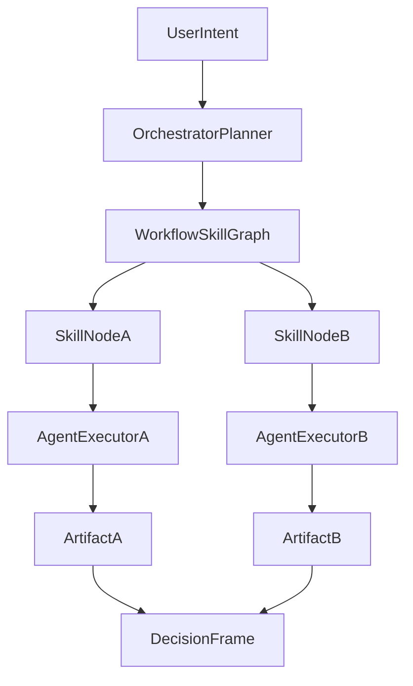
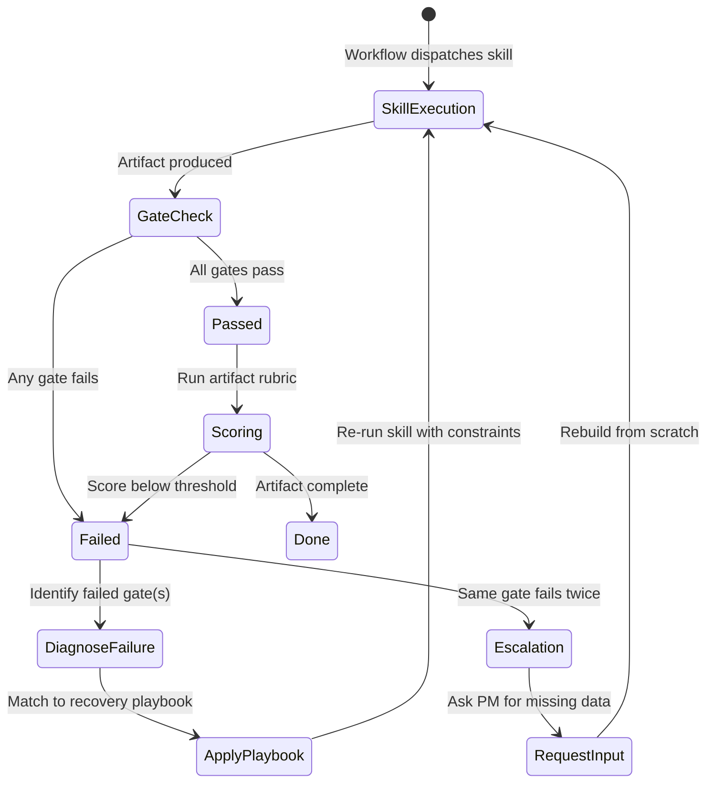

# Composition Model

Shipwright has four layers. Each layer builds on the one below it. Understanding how they compose lets you build custom workflows, assign agents to new tasks, and reason about what's happening when you type `/start`.

## The four layers

```
┌──────────────────────────────────────────────────┐
│  Orchestra                                        │
│  Agent routing + parallel execution (/start)      │
│                                                    │
│  ┌──────────────────────────────────────────────┐ │
│  │  Workflow                                     │ │
│  │  Ordered skill chain with PM checkpoints      │ │
│  │  (commands/*.md)                              │ │
│  │                                                │ │
│  │  ┌──────────────────────────────────────────┐ │ │
│  │  │  Agent                                    │ │ │
│  │  │  Role + constraints + skill access        │ │ │
│  │  │  (agents/*.md)                            │ │ │
│  │  │                                            │ │ │
│  │  │  ┌──────────────────────────────────────┐ │ │ │
│  │  │  │  Skill                                │ │ │ │
│  │  │  │  Atomic capability: one framework,    │ │ │ │
│  │  │  │  one output (skills/**/SKILL.md)      │ │ │ │
│  │  │  └──────────────────────────────────────┘ │ │ │
│  │  └──────────────────────────────────────────┘ │ │
│  └──────────────────────────────────────────────┘ │
└──────────────────────────────────────────────────┘
```

## Core primitives

This is the shortest mental model for advanced users:

```text
Workflow = graph(Skills)
Agent = constrained executor
Orchestrator = planner over graph
```

- **Workflow = graph(Skills):** A workflow is not just a list - it's a dependency graph of skill outputs feeding downstream steps.
- **Agent = constrained executor:** Agents execute graph nodes within role boundaries and refusal constraints.
- **Orchestrator = planner over graph:** The orchestrator chooses which graph to run, then schedules sequential vs parallel execution based on dependencies.



### Skill — atomic capability

A skill is a single markdown file that teaches the AI one PM framework and produces one type of artifact.

**Properties:**
- Self-contained. A skill never references another skill, an agent, or a command.
- Portable. Works in any AI tool that can read a markdown file.
- Deterministic output. Each skill defines exactly what it produces (e.g., "a SWOT grid with cross-referenced strategic options").

**Location:** `skills/<category>/<skill-name>/SKILL.md`

**Use directly:** `Read skills/strategy/swot-analysis/SKILL.md and run a SWOT on [topic].`

### Agent — role + constraints

An agent is a role definition that gives the AI a persona, a set of skills it can use, and explicit boundaries on what it will NOT do.

**Properties:**
- Scoped authority. Each agent can access a defined subset of skills and refuses work outside its domain.
- Negative constraints. Every agent has a "What You Do NOT Do" section that prevents role drift.
- Tool access. Agents can use Claude Code tools (Read, Write, Bash, WebSearch, etc.) within their role.

**Location:** `agents/<agent-name>.md`

**Key principle:** Agents are separated by function — research, strategy, execution, customer intelligence, communication — so no single agent tries to do everything. This keeps the PM in the decision seat.

### Workflow — ordered skill chain

A workflow is a command file that chains 3-5 skills together in sequence, with PM checkpoints between steps.

**Properties:**
- Sequential. Each step's output feeds the next step's input.
- Interactive. Steps include "Ask the PM" prompts that pause for human input.
- Composable from skills. Every step references a specific SKILL.md file.

**Location:** `commands/<workflow-name>.md`

**Key principle:** Workflows encode a repeatable PM process. The sequencing is the value — a PRD that starts with a press release (step 1) produces a fundamentally different artifact than one that starts with requirements.

### Orchestra — agent routing + parallel execution

The orchestrator (`/start`) sits above workflows and agents. It routes work to the right place based on what the PM needs.

**Properties:**
- Routes, doesn't produce. The orchestrator never creates artifacts — it dispatches to agents and workflows.
- Parallel execution. When steps don't depend on each other, the orchestrator runs them in parallel.
- Simplicity preference. It suggests the simplest approach that fits: one skill > one workflow > multi-agent orchestration.
- Phased execution. When web-heavy research threatens the time budget, it splits research, synthesis, and packaging into separate phases.
- Single dispatcher. The orchestrator dispatches agents; specialist agents return artifacts inline instead of recursively spawning more agents.

**Location:** `agents/orchestrator.md` + `commands/start.md` + `skills-map.md`

## Quality gate lifecycle

Every skill execution passes through a gate check before the artifact is considered done. The orchestrator and workflows enforce this cycle automatically; standalone skill use requires manual gate checks.



**Gate check** runs the core and artifact-specific gates from [pass-fail.md](../evals/pass-fail.md). A single failed gate means the artifact is not done — no partial pass, no "good enough" override.

**Recovery** is deterministic: each failed gate maps to a specific playbook in [recovery-playbooks.md](recovery-playbooks.md) with a trigger → action → expected correction pattern.

**Escalation** fires when the same gate fails on re-run. At that point the system stops iterating on wording and asks the PM for the missing input data, then rebuilds from scratch.

For the full list of failure patterns by agent, see [failure-modes.md](failure-modes.md).

For high-stakes artifacts, teams may optionally run an adversarial review after pass/fail gates and before final delivery. This is a separate review artifact, not a new global gate.

## Composition rules

### Combining skills into a workflow

A workflow is a markdown file in `commands/` that chains skills in sequence.

**Pattern:**
```markdown
---
name: workflow-name
description: "What this workflow produces."
---

# /workflow-name — Workflow Title

Brief purpose.

## Workflow Steps

### Step 1: Step Name
Read and apply the framework from `/skills/category/skill-name/SKILL.md`.

Ask the PM:
- [Context question]
- [Scope question]

Produce [artifact name].

### Step 2: Step Name
Using the output from Step 1, read and apply `/skills/category/other-skill/SKILL.md`.

[... more steps ...]

## Output
Produce a **[Document Name]** containing:
1. Artifact from step 1
2. Artifact from step 2
3. Recommended next steps
```

**Rules:**
- 3-5 steps. More than 5 means it should be split into two workflows.
- Each step references one SKILL.md.
- Include "Ask the PM" prompts where human judgment is needed.
- Later steps should reference outputs from earlier steps.

### Assigning agents to workflows

The `manifest.json` file maps workflows to agents via the `routing` section:

```json
{
  "routing": {
    "write-prd": {
      "agent": "execution-driver",
      "skills": ["prd-development", "user-story-writing"]
    },
    "plan-launch": {
      "agents": ["strategy-planner", "execution-driver"],
      "skills": ["go-to-market-strategy", "positioning-statement"]
    }
  }
}
```

**Rules:**
- Single-agent workflows use `"agent"` (singular).
- Multi-agent workflows use `"agents"` (array). The first agent is primary.
- `"skills"` lists the key skills used (for orchestrator routing, not enforcement).

### Tracking parallel execution

When the orchestrator dispatches multiple agents (in parallel or sequence), it emits an **execution tracker** — a markdown checklist that shows what's running, what's done, and what's blocked. This is not a database; it's a convention the orchestrator follows so the PM can see progress at a glance.

```markdown
## Execution Plan
- [x] Step 1: Discovery research (@discovery-researcher) — done (OST with 3 areas)
- [x] Step 2: Competitive analysis (@discovery-researcher) — done, parallel with Step 1
- [ ] Step 3: Strategy synthesis (@strategy-planner) — in progress, blocked on Steps 1, 2
- [ ] Step 4: PRD (@execution-driver) — blocked on Step 3
```

**Rules:**
- Emit the tracker before dispatching the first agent.
- Update it as each step completes, marking `[x]` and noting key outputs.
- Mark blocked steps explicitly so the PM knows what's waiting.
- If a step fails or needs PM input, mark it with a note instead of silently stalling.

### Creating multi-agent workflows

Some workflows need multiple agents. The `/plan-launch` workflow uses both `strategy-planner` (for positioning and GTM) and `execution-driver` (for timeline and launch tasks).

**When to use multiple agents:**
- The workflow crosses role boundaries (e.g., strategy + execution).
- Different steps need different expertise and constraint sets.
- Parallel execution is valuable (agents can work simultaneously on independent steps).

**When to stick with one agent:**
- All steps fall within a single agent's domain.
- The overhead of agent handoff isn't worth the specificity.

## Build your own: quarterly business review

Here's a walkthrough of creating a custom workflow from existing skills.

### 1. Define what you need

A quarterly business review that covers: metrics review, customer health, strategic assessment, and next-quarter priorities.

### 2. Pick the skills

| Step | Skill | Why |
|---|---|---|
| 1 | `metrics-dashboard` | Review North Star and input metrics against targets |
| 2 | `feedback-triage` | Synthesize customer feedback from the quarter |
| 3 | `churn-analysis` | Analyze retention patterns and churn drivers |
| 4 | `product-strategy-session` | Reassess strategic bets based on quarterly results |

### 3. Write the workflow

Create `commands/quarterly-review.md`:

```markdown
---
name: quarterly-review
description: "End-of-quarter business review combining metrics, customer signals, and strategic reassessment."
---

# /quarterly-review — Quarterly Business Review

Produces a comprehensive quarterly review by analyzing metrics performance, synthesizing
customer signals, and reassessing strategic bets.

## Workflow Steps

### Step 1: Metrics Review
Read and apply the framework from `/skills/measurement/metrics-dashboard/SKILL.md`.

Ask the PM:
- What were the North Star and input metric targets for this quarter?
- What are the actual results?

Produce a metrics scorecard with target vs. actual, trends, and areas of concern.

### Step 2: Customer Signal Synthesis
Read and apply the framework from `/skills/customer-intelligence/feedback-triage/SKILL.md`.

Using the metrics context from Step 1, synthesize customer feedback from the quarter.

Ask the PM:
- Paste or describe the main customer feedback channels (NPS comments, support themes, CAB notes).

Produce a themed feedback summary with priority signals.

### Step 3: Retention Analysis
Read and apply the framework from `/skills/customer-intelligence/churn-analysis/SKILL.md`.

Using the signals from Step 2, analyze retention patterns.

Ask the PM:
- What is the current churn rate vs. target?
- Any notable customer losses this quarter?

Produce a retention diagnosis with intervention recommendations.

### Step 4: Strategic Reassessment
Read and apply the framework from `/skills/strategy/product-strategy-session/SKILL.md`.

Using the metrics scorecard (Step 1), customer signals (Step 2), and retention analysis (Step 3),
reassess the current strategic bets.

Ask the PM:
- Which bets from last quarter should we keep, adjust, or kill?

Produce an updated strategy assessment with next-quarter priorities.

## Output

Produce a **Quarterly Business Review** containing:
1. Metrics scorecard (target vs. actual)
2. Customer signal summary
3. Retention analysis and interventions
4. Strategic bet reassessment (keep / adjust / kill)
5. Recommended priorities for next quarter
```

### 4. Register it

Add routing to `manifest.json`:

```json
"quarterly-review": {
  "agents": ["customer-intelligence", "strategy-planner"],
  "skills": ["metrics-dashboard", "feedback-triage", "churn-analysis", "product-strategy-session"]
}
```

### 5. Use it

```
/quarterly-review
```

The orchestrator will pick it up from `commands/quarterly-review.md` and route it through the assigned agents.

## Choosing the right level

| If you need... | Use... | Example |
|---|---|---|
| One framework applied to one question | A skill directly | "Run a SWOT on our mobile strategy" |
| A repeatable multi-step process | A workflow | `/write-prd` for every new feature |
| Guidance on which skill or workflow fits | The orchestrator | `/start` → "I need to prepare for a board meeting" |
| A custom process your team repeats | Build a new workflow | `/quarterly-review` for end-of-quarter |

The simplest approach that fits is always the right one. Don't orchestrate what a single skill can handle.
